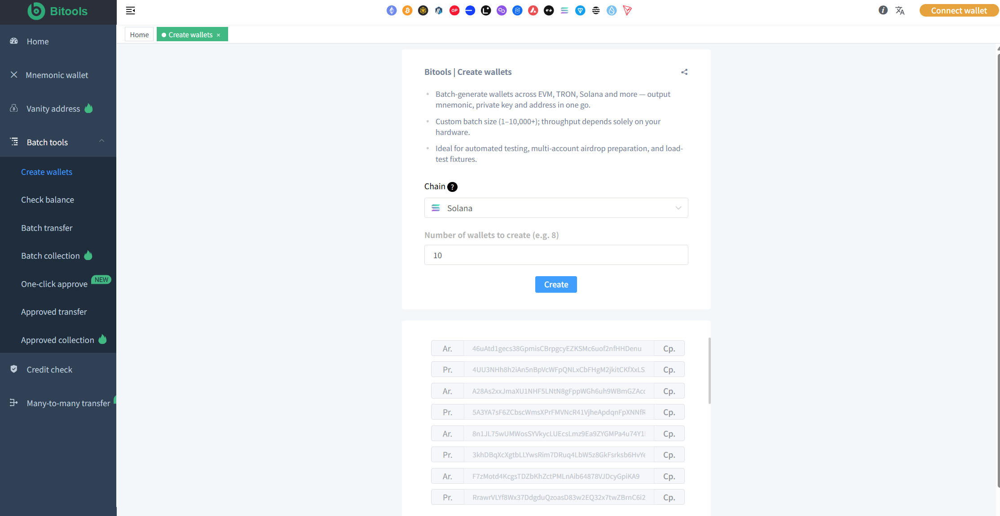

# Solana Tools

**A collection of practical Solana tools for Web3 users, developers and wallet operators.**

[](LICENSE)
[](https://solana.com)
[](https://www.typescriptlang.org/)

</div>

---

## 📖 Overview

**Bitools Solana Tools** focuses on common wallet and blockchain operations, providing a practical toolkit for everyday Solana use cases.

It covers the most frequently needed operations including:

- Wallet generation
- Bulk transfers
- Balance checking
- Wallet sweeping
- Security tools
- Multisig management
- Asset management

---
## ✨ Features

- 🔑 **Wallet Generation** — Quickly generate single or multiple Solana wallets
- 💸 **Bulk Transfers** — Send SOL or tokens to multiple addresses efficiently
- 📊 **Balance Checker** — Check SOL and token balances in batch
- 🧹 **Wallet Sweeper** — Consolidate assets from multiple wallets into one
- 🛡️ **Security Tools** — Help protect wallets and private keys
- 👥 **Multisig Support** — Manage and interact with multisig wallets
- 🗂️ **Asset Management** — View and manage tokens & NFTs across wallets

---

## 📸 Screenshots

<div align="center">
  
  <br/>
  <em>Main Dashboard</em>
</div>

<br/>

| Wallet Tools | Bulk Operations |
|--------------|-----------------|
|  

## 🛠️ Tech Stack

<p align="center">
  
  
  
  
</p>

### Solana Wallet

- Solana Wallet Generator
- Multiple Solana Wallet Generator
- Solana Wallet Management
- Solana Wallet Address Tools
- Solana Vanity Address Generator

### Solana Transfers

- SOL Transfer
- Solana Bulk Transfer
- Multiple Wallet Transfers
- SPL Token Transfers

### Solana Balance

- Solana Balance Checker
- Multiple Wallet Balance Checker
- SOL Balance Checker
- SPL Token Balance Checker

### Solana Wallet Sweeper

- Solana Wallet Sweeping
- Wallet Consolidation
- Multiple Wallet Management

### Solana Security

- Solana Wallet Security
- Solana Transaction Checking
- Solana Token Account Checking
- Solana Token Authority Checking

### Solana Multisig

- Solana Multisig Wallet
- Multisig Transaction Management

### Solana Address

- Solana Address Checker
- Solana Address Activity
- Solana Token Accounts

### SPL Token

- SPL Token Information
- SPL Token Balance
- SPL Token Holders
- SPL Token Transfers

## Solana Wallet Generator

Generating and managing multiple Solana wallets can be useful for testing, development and legitimate Web3 operations.

Learn more:

https://bitools.pro/solana/

## Solana Bulk Transfer

Solana bulk transfer tools can simplify sending SOL or supported SPL tokens to multiple addresses.

Learn more:

https://bitools.pro/solana/

## Solana Balance Checker

Check SOL and token balances across Solana wallet addresses.

Learn more:

https://bitools.pro/solana/

## Solana Wallet Sweeper

Wallet sweeping and consolidation tools can help organize assets across multiple Solana wallets.

Learn more:

https://bitools.pro/solana/

## Solana Multisig

Explore Solana multisig concepts and wallet management workflows.

Learn more:

https://bitools.pro/solana/

## Solana Vanity Address

Learn how Solana vanity addresses work and how custom address generation can be implemented.

Learn more:

https://bitools.pro/solana/

## Documentation

- [Solana Wallet](docs/solana-wallet.md)
- [Solana Bulk Transfer](docs/solana-bulk-transfer.md)
- [Solana Balance](docs/solana-balance.md)
- [Solana Wallet Sweeper](docs/solana-wallet-sweeper.md)
- [Solana Security](docs/solana-security.md)
- [Solana Multisig](docs/solana-multisig.md)
- [Solana Vanity Address](docs/solana-vanity-address.md)
- [SPL Token](docs/spl-token.md)
- [Solana Transaction](docs/solana-transaction.md)
- [Solana Address](docs/solana-address.md)

## Examples

The `examples` directory contains practical examples for Solana wallet, balance, transfer, token and transaction operations.

## Contributing

Contributions, bug reports and suggestions are welcome.

Please open an issue before making major changes.

## 📦 Installation

```bash
# Clone the repository
git clone https://github.com/yourusername/solana-tools.git

cd solana-tools

# Install dependencies
npm install
# or
pnpm install
# or
yarn

## License

See the LICENSE file.

## Website

https://bitools.pro
